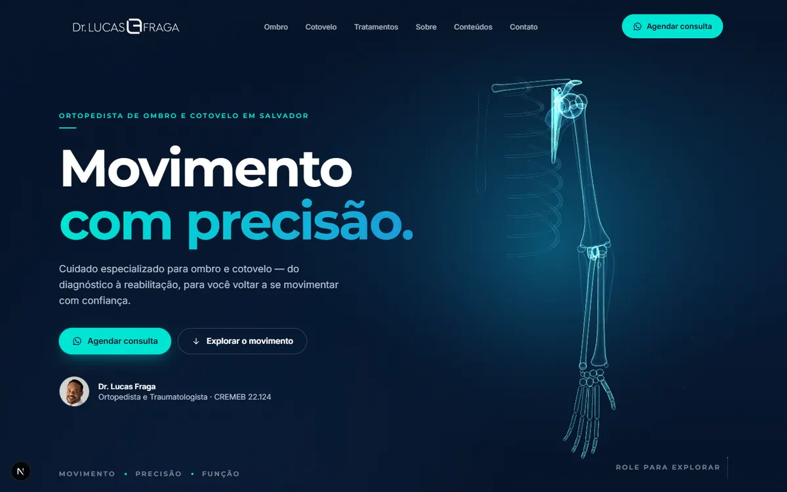
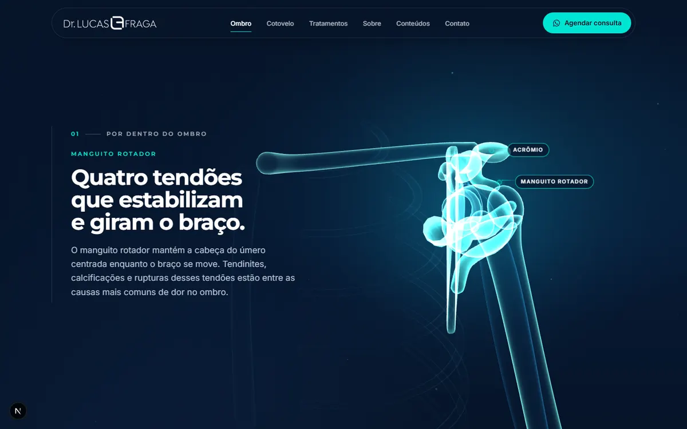
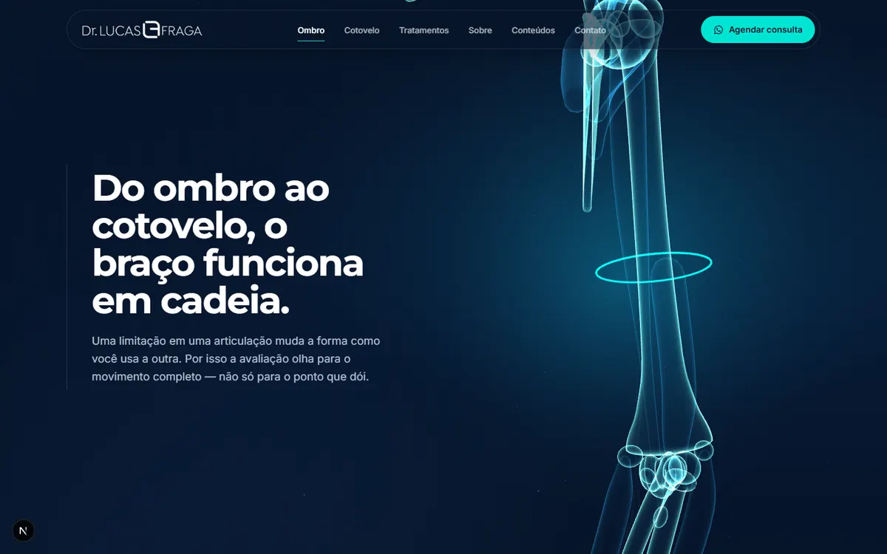
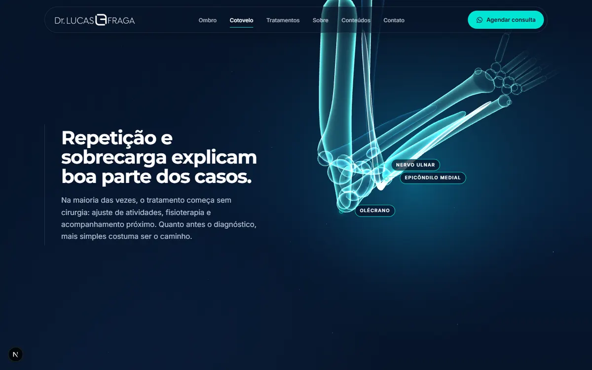

# Site Dr. Lucas Fraga — Ombro e Cotovelo

Site institucional com narrativa guiada por scroll e modelo anatômico 3D do membro superior.
Conceito central: **MOVIMENTO**.



| Manguito rotador | Transição ombro → cotovelo | Cotovelo |
| --- | --- | --- |
|  |  |  |

---

## Stack

Next.js 16 (App Router, Turbopack) · React 19 · TypeScript · Tailwind CSS 4 ·
Three.js · React Three Fiber · Drei · GSAP + ScrollTrigger

```bash
npm install
npm run dev        # http://localhost:3000
npm run build && npm start
```

**Deploy na Vercel:** importe o repositório — nenhuma configuração extra é necessária
(todas as páginas são estáticas). Depois do deploy, aponte o domínio `drlucasfraga.com.br`.

---

## Direção visual (extraída dos materiais enviados)

| Elemento | Decisão |
| --- | --- |
| Paleta | Azul-marinho `#0B1F3B` / `#061429` (confiança) · Ciano `#00E5D3` (tecnologia, movimento) · Branco · Cinza frio `#6B7B8F`. Azul `#1A9BD7` e verde `#17A77E` do logotipo como acentos pontuais |
| Tipografia | Montserrat (títulos, 600–800, tracking negativo) + Inter (textos). Sem serifas |
| Linguagem gráfica | Rótulos em caixa-alta espaçada com traço ciano, molduras de cantos curvos com contorno fino, grade de pontos, linhas curvas |
| Contraste | Áreas escuras (narrativa 3D, contato) alternadas com áreas claras (cirurgia, sobre, conteúdos) |
| 3D | Anatomia estilizada em "raio-X holográfico": bordas acesas (fresnel), miolo translúcido, sem realismo excessivo |
| Fotos | Jaleco + SBCOC → seção Sobre (autoridade). Retrato em fundo escuro → faixa editorial (proximidade) e imagem de compartilhamento |

---

## Estrutura

```
app/                      rotas, metadata, sitemap, robots, ícones, OG image
  conteudos/              listagem e páginas de artigos (SSG)
content/                  ⟵ TUDO QUE É EDITÁVEL
  site.ts                 nome, CRM/RQE, telefone, WhatsApp, e-mail, Instagram, convênios, menu
  home.ts                 textos de todas as seções da home
  locations.ts            cidades e locais de atendimento
  articles.ts             artigos + slugs antigos redirecionados
  scene-keyframes.ts      o que o 3D faz em cada trecho do scroll
components/
  layout/                 Header, Footer, CTA fixo mobile
  sections/               uma seção da home por arquivo
  three/                  palco 3D, cena, rig de câmera, modelo, materiais
    anatomy/              geometria procedural (ossos, tendões, nervo, rótulos)
  articles/ ui/ motion/   cards, capas generativas, botões, ícones, animações de entrada
lib/
  scroll/story.ts         scroll → timeline GSAP → estado do 3D
  seo.ts                  JSON-LD (Physician, MedicalWebPage)
  webgl.ts                decide 3D vs. fallback
public/brand  public/images   logotipos e fotos
```

### Como editar

- **Textos da home:** `content/home.ts`
- **Contato / registro profissional:** `content/site.ts` (o RQE aparece automaticamente quando preenchido)
- **Locais:** `content/locations.ts` — preencha `address` quando confirmar; enquanto vazio, "Ver no mapa" usa a busca do Google Maps
- **Artigos:** adicione um objeto em `content/articles.ts`; página, listagem e sitemap são gerados sozinhos
- **Fotos:** substitua os arquivos em `public/images` mantendo os nomes
- **Movimento do 3D:** `content/scene-keyframes.ts` (câmera, ângulos das articulações, destaques, rótulos)

---

## Como o 3D funciona

```
scroll ──► ScrollTrigger ──► posição na timeline GSAP ──► story.target
                                                             │
                     render loop (R3F) amortece os valores ◄─┘
                     └► câmera · ombro · cotovelo · prono-supinação · destaques · rótulos
```

1. Cada keyframe em `content/scene-keyframes.ts` é ancorado a um elemento com `data-scene="<id>"`.
   Quando o elemento está no centro da tela, o modelo atinge aquela pose; entre âncoras, o GSAP interpola —
   funciona nos dois sentidos do scroll.
2. Em torno de cada âncora há uma pequena zona de "pausa" para a leitura do texto.
3. O render loop amortece os valores (movimento contínuo, sem trancos) e adiciona uma respiração sutil.
4. Telas < 1024 px usam enquadramentos próprios (`compact`): o modelo sobe e o texto vira um cartão na base.

**Modelo procedural.** Clavícula, escápula, úmero, rádio, ulna e mão são gerados por código
(`components/three/anatomy/skeleton.ts`) — sem arquivo para baixar. Tendões do manguito, bíceps,
tríceps, grupos extensor/flexor e nervo ulnar são recalculados a cada pose, acompanhando as articulações.

**Trocar por um modelo GLB.** Reproduza a mesma hierarquia de pivôs
(`girdle → shoulder → elbow → radiusPivot`) com os nomes de nós correspondentes e substitua os
`<mesh>` em `components/three/ArmModel.tsx`; a timeline, os rótulos e o rig de câmera continuam iguais.
Use compressão Draco/Meshopt e mantenha o arquivo abaixo de ~1,5 MB.

### Performance e fallback

- A cena 3D é carregada **depois** do conteúdo (`next/dynamic` + `requestIdleCallback`) — não afeta o LCP.
- Material sem luzes nem texturas (fresnel aditivo), geometrias mescladas, pixel ratio limitado (1,75 desktop / 1,5 mobile)
  e ajuste automático de resolução (`PerformanceMonitor`).
- O render **pausa** quando seções sólidas cobrem o palco.
- Sem WebGL, com economia de dados ativa ou em aparelhos muito modestos, entra uma ilustração vetorial
  equivalente. Conteúdo e conversão não dependem do 3D.

Parâmetros úteis para revisão:

| URL | Efeito |
| --- | --- |
| `?3d=0` | força o fallback (sem WebGL) |
| `?qa=1` | desliga amortecimento e animações de entrada — capturas mostram exatamente cada keyframe |

### Acessibilidade

HTML semântico com hierarquia de títulos, link "pular para o conteúdo", foco visível, menu mobile com
`Esc`, rótulos do 3D marcados como decorativos (a informação está no texto), contraste AA e
`prefers-reduced-motion` (amplitudes reduzidas, sem respiração do modelo, entradas só com fade).

### SEO

Metadata por página, Open Graph/Twitter, `sitemap.xml`, `robots.txt`, JSON-LD (`Physician` com cidades
atendidas e `MedicalWebPage` nos artigos), canonical e redirecionamentos 308 das URLs do WordPress
antigo (`/sobre-mim`, `/blog`, `/fale-conosco`, `/conteudos/<slug>` …). Os slugs dos artigos foram mantidos.

---

## Pendências para publicar

- [ ] **RQE** — preencher em `content/site.ts` (Res. CFM nº 2.336/2023 pede o RQE ao anunciar especialidade)
- [ ] **Endereços completos** dos 8 locais (`content/locations.ts`)
- [ ] **Convênios** — confirmar a lista e a cobertura por local
- [ ] **Link do app iOS** (o site anterior não tinha link válido)
- [ ] **Revisar os 9 artigos** (reescritos de forma resumida) e migrar os demais 21 do site antigo, que hoje redirecionam para `/conteudos`
- [ ] Validar termos como "especialista" na comunicação, conforme registro de qualificação
- [ ] Depoimentos de pacientes **não** foram incluídos por cautela com as regras de publicidade médica
